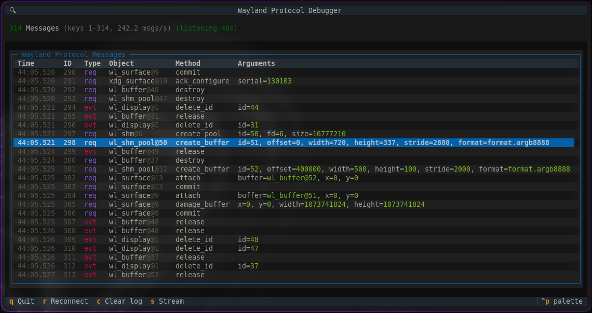

# API Documentation

All the Wayland interfaces are available in the [`wayland` namespace.](../wayland/index.md)

`wayland.client` provides additional functionality that is not part of the low-level Wayland protocol. Helper or convenience functions to assist with developing using `python-wayland`.

## Wayland Protocol Debugger

The most useful feature is the Wayland protocol debugger. This allows you to monitor all requests and events between your application and the Wayland compositor.

This is easy to use in your application. See the [documentation here](client.md#wayland.client.start_debug_server).
